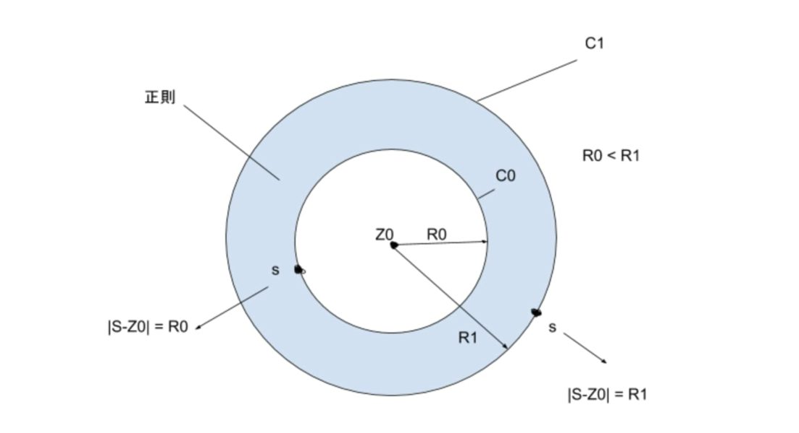

===============================================
夏季試験(2024年8月)
===============================================

問題は以下である。

* 数学・物理学 I (3問,135分): https://www.phys.se.tmu.ac.jp/wp-content/uploads/2025/02/2025Scover_new_FV_tot.pdf
* 物理学 II (2問,100分): https://www.phys.se.tmu.ac.jp/wp-content/uploads/2025/02/2025Scover_new_FV_totdown.pdf

準備
===============================================

複素関数のイメージ
------------------------------------

実数値の関数のグラフは、これまで意識することなく描いてきたように、
（1変数関数であれば） :math:`xy` 平面上にグラフ :math:`f(x)` を描画することができる。
しかし、これと異なり、複素数値の関数のグラフは一つの平面上に表すことはできない。
複素関数 :math:`f(z) \quad (z = x + iy)` は二つの変数 :math:`x, y` で表され、
変換後の値（複素数） :math:`w = f(z)` も二つの変数 :math:`u(x, y), v(x, y)` で表されるので、
4次元となるため、一つの平面上でグラフを表現することは難しい。
なので、通常は変換前の複素数平面 :math:`z` と変換後の複素数平面 :math:`w` を考え、
もとの平面上の座標や図形がどのように変換されるかを追うことで、関数について知ることができる。

例えば、次の関数（変換）により、座標や図形がどのように変換されるかを考えてみる。

.. math::
    w = z + \frac{1}{z}

座標や図形としては、 :math:`z` 平面上で半径1の円、半径 :math:`r` の円、および :math:`x` 軸上の線分を対象にすることとする。

まず、 :math:`x` 軸上の線分について調べてみる。
:math:`z` 平面上の :math:`x` 軸上の点 (1, 0) を考えると、
これは :math:`z = 1` なので :math:`w` は :math:`w = 1 + \frac{1}{1} = 2` となる。
なので、:math:`w` 平面上では点 (2, 0) に移ることとなる。

次に :math:`x` 軸上で :math:`x > 1` の半直線を調べよう。
このとき :math:`z = x` なので :math:`w = x + \frac{1}{x}` に移る。
:math:`x > 1` を考えているので :math:`w > 2` である。
微分すると :math:`\frac{dw}{dx} = 1 - \frac{1}{x^2} > 0 (x > 1)` なので、
:math:`z` 平面上で :math:`x` が大きくなる方向へ移動すると、
:math:`w` 平面上でも :math:`u` が大きくなる方向へ移動することがわかる。

次に半径1の半円を調べてみる。
半径1の半円は :math:`z = e^{i \theta}, (0 \leq \theta \leq \pi)` と表せる。
なので :math:`w = e^{i \theta} + e^{-i \theta} = 2 \cos \theta` となり、
取りうる値の範囲は :math:`-2 \leq w(= 2 \cos \theta) \leq 2` である。
したがって、 :math:`z` 平面上での半円は :math:`w` 平面上では :math:`x` 軸上の線分に移る。
:math:`z` 平面上で :math:`\theta` が 0 のとき :math:`w` 平面上では :math:`x` が最大となり、
:math:`\theta` が大きくなるにつれて :math:`x` は小さくなる方向に移動していくことがわかる。

最後に半径 :math:`r_0` の半円がどのように移るかを考えよう。
この半円は :math:`z = r_0 e^{i \theta}` と表せるので、
:math:`w = r_0 e^{i \theta} + \frac{1}{r_0 e^{i \theta}}` となる。
これは次のように変形できる。

.. math::
    w &= r_0 e^{i \theta} + r_0^{-1} e^{-i \theta} \\
      &= (r_0 + r_0^{-1}) \cos \theta + i(r_0 - r_0^{-1}) \sin \theta \\
      &= a \cos \theta + i b \sin \theta \quad (a = r_0 + r_0^{-1}, b = r_0 - r_0^{-1}) \\
    (\frac{u}{a})^2 + (\frac{v}{b})^2 &= 1

これは焦点が :math:`w = \pm \sqrt{a^2 - b^2} = \pm 2` の楕円である。

以上のように、各座標や図形について関数 :math:`f(z)` によってどのように変換されるかを
調べることで、その関数の概要を知ることが可能である。

.. note:: 楕円の式
    
    楕円とは、2定点からの距離の和が一定となるような平面上の点の軌跡である。
    この定点のことを焦点という。
    楕円の中心を原点としたデカルト座標 :math:`X, Y` では楕円は次のように表される。

    .. math::
        \frac{X^2}{a^2} + \frac{Y^2}{b^2} = 1
    
    これは以下のようにして導かれる。
    まず、2つの焦点を :math:`X` 軸上におき、:math:`F(c, 0), F'(-c, 0) \quad (c > 0)` とする。
    点 :math:`P` の座標を :math:`(X, Y)` とすると

    .. math::
        PF + PF' &= const. = 2a \quad (\text{これは楕円の定義より}) \\
        \sqrt{(X -c)^2 + Y^2} + \sqrt{(X + c)^2 + Y^2} &= 2a \\
        (X + c)^2 + Y^2 &= \{2a - \sqrt{(X - c)^2 + Y^2}\}^2 \\
        &= 4a^2 -4a \sqrt{(X - c)^2 + Y^2} + (X - c)^2 + Y^2 \\
        \sqrt{(X - c)^2 + Y^2} &= a - \frac{c}{a} X \\
        (X - c)^2 + Y^2 &= a^2 -2cX + \frac{c^2}{a^2} X^2 \\
        (1 - \frac{c^2}{a^2}) X^2 + Y^2 &= a^2 - c^2 \\
        \frac{X^2}{a^2} + \frac{Y^2}{a^2 - c^2} &= 1
    
    ここで :math:`b^2 = a^2 - c^2` とおけば

    .. math::
        \frac{X^2}{a^2} + \frac{Y^2}{b^2} = 1
    
    となり、楕円の式を得る。

.. note:: :math:`\epsilon - \delta` 論法

    （TBD）

コーシー・リーマンの方程式
------------------------------------

複素関数における重要な式の一つに、コーシー・リーマンの方程式がある。
これは関数 :math:`f(z) = u(x, y) + iv(x, y)` が微分可能であるとき、
:math:`u, v` の偏導関数の間に成り立つ関係を述べたものである。
この方程式は関数 :math:`f(z)` の微分可能性ともかかわっている。

コーシー・リーマンの方程式は次である。
関数 :math:`f(z) = u(x, y) + iv(x, y)` が :math:`z_0 = x_0 + iy_0` で微分可能であるとき、
次の関係をコーシー・リーマンの方程式という。

.. math::
    u_x (x_0, y_0) &= v_y (x_0, y_0) \\
    u_y (x_0, y_0) &= -v_x (x_0, y_0) \\

これは以下のようにして導くことができる。
いま、 :math:`f(z)` が :math:`z_0 = x_0 + iy_0` で微分可能としているので、次の極限が存在する。

.. math::
    f'(z_0) = \lim_{\varDelta z \to 0} \frac{f(z_0 + \varDelta z) - f(z_0)}{\varDelta z}

複素数の極限が存在するとき、実部、虚部それぞれで極限をとったものと同値なので、

.. math::
    \text{Re} f'(z_0) &= \lim_{(\varDelta x, \varDelta y) \to (0, 0)} \text{Re} \frac{f(z_0 + \varDelta z) - f(z_0)}{\varDelta z} \\
    \text{Im} f'(z_0) &= \lim_{(\varDelta x, \varDelta y) \to (0, 0)} \text{Im} \frac{f(z_0 + \varDelta z) - f(z_0)}{\varDelta z}

が成り立つ。
そして次の変化量を計算する。

.. math::
    \frac{f(z_0 + \varDelta z) - f(z_0)}{\varDelta z}
    = \frac{{u(x_0 + \varDelta x, y_0 + \varDelta y) - u(x_0, y_0)} + i{v(x_0 + \varDelta x, y_0 + \varDelta y) - v(x_0, y_0)}}{\varDelta x + i \varDelta y}

極限はただ一つなので、いかなる方向から :math:`\varDelta z \to 0` としても常に一つの値 :math:`f'(z_0)` が定まる。
同様に :math:`Re f'(z_0), Im f'(z_0)` の式についてもどのような向きから極限をとっても値は一つ（:math:`Re f'(z_0), Im f'(z_0)`）に定まる。
そこで、特に :math:`\varDelta y = 0` とし、 :math:`\varDelta x \to 0` としても極限の値は変わらないから、
上式で :math:`\varDelta y = 0` とすると

.. math::
    \frac{f(z_0 + \varDelta z) - f(z_0)}{\varDelta z}
    &= \frac{{u(x_0 + \varDelta x, y_0) - u(x_0, y_0)} + i{v(x_0 + \varDelta x, y_0) - v(x_0, y_0)}}{\varDelta x} \\
    &= \frac{u(x_0 + \varDelta x, y_0) - u(x_0, y_0)}{\varDelta x} + i \frac{v(x_0 + \varDelta x, y_0) - v(x_0, y_0)}{\varDelta x}

よって、

.. math::
    \text{Re} f'(z_0) &= \lim_{(\varDelta x, \varDelta y) \to (0, 0)} \text{Re} \frac{f(z_0 + \varDelta z) - f(z_0)}{\varDelta z} \\
    &= \lim_{\varDelta x \to 0} \frac{u(x_0 + \varDelta x, y_0) - u(x_0, y_0)}{\varDelta x} \\
    &= u_x(x_0, y_0)

同様に

.. math::
    \text{Im} f'(z_0) &= \lim_{(\varDelta x, \varDelta y) \to (0, 0)} \text{Im} \frac{f(z_0 + \varDelta z) - f(z_0)}{\varDelta z} \\
    &= \lim_{\varDelta x \to 0} \frac{v(x_0 + \varDelta x, y_0) - v(x_0, y_0)}{\varDelta x} \\
    &= v_x(x_0, y_0)

よって、

.. math::
    f'(z_0) = u_x(x_0, y_0) + iv_x(x_0, y_0)

が成り立つ。
先ほどは :math:`\varDelta y = 0` としてが、 :math:`\varDelta x = 0` とすることで、
同様の方法で次の関係式が導かれる。

.. math::
    f'(z_0) = v_y(x_0, y_0) - iu_y(x_0, y_0)

:math:`f'(z_0)` はただ一つの値なので、次の関係式、つまり、コーシー・リーマンの方程式が成り立つ。

.. math::
    u_x(x_0, y_0) &= v_y(x_0, y_0) \\
    v_x(x_0, y_0) &= -u_y(x_0, y_0)

.. note:: 合成関数の微分

    はじめに1変数関数の連鎖律を見る。
    :math:`z = f(x, y)` が全微分可能で :math:`x = x(t), y = y(t)` が微分可能であるとき、
    合成関数 :math:`z = f(x(t), y(t))` は :math:`t` の関数として微分可能で次が成り立つ。

    .. math::
        \frac{dz}{dt} = \frac{\partial f}{\partial x} \frac{dx}{dt} + \frac{\partial f}{\partial y} \frac{dy}{dt}

    2変数関数も同様に考えることができる。 :math:`z = f(x, y), x = x(u, v), y = y(u, v)` のとき、
    
    .. math::
        \frac{\partial z}{\partial u} &= \frac{\partial f}{\partial x} \frac{\partial x}{\partial u}
        + \frac{\partial f}{\partial y} \frac{\partial y}{\partial u} \\
        \frac{\partial z}{\partial v} &= \frac{\partial f}{\partial x} \frac{\partial x}{\partial v}
        + \frac{\partial f}{\partial y} \frac{\partial y}{\partial v}

    （参考）https://www2.math.kyushu-u.ac.jp/~hara/lectures/12/biseki1213b.pdf

微分可能性についてみるため、次の関数を考えてみる。

.. math::
    f(z) = |z^2|

変化量は次のように計算できる。

.. math::
    \frac{\varDelta w}{\varDelta z} = \frac{|z + \varDelta z|^2 - |z^2|}{\varDelta z}
    = \frac{(z + \varDelta z)(\bar{z} + \bar{\varDelta z}) - z \bar{z}}{\varDelta z} = \bar{z} + \bar{\varDelta z} + z \frac{\bar{\varDelta z}}{\varDelta z}

これより、 :math:`z = 0` においては、 :math:`\varDelta w / \varDelta z = \bar{\varDelta z}` となる。
よって、極限が存在、つまり、微分可能でその値は :math:`f'(0) = \lim_{\varDelta z \to 0} \bar{\varDelta z} = 0` である。

一方、 :math:`z \neq 0` の場合は少し異なる。
変化量 :math:`\varDelta z` が :math:`\varDelta z = \bar{\varDelta z}` の場合、すなわち、 :math:`\varDelta z` が実数の場合、

.. math::
    \varDelta z \to 0 \Longrightarrow \varDelta w / \varDelta z = \bar{z} + \varDelta z + z \to \bar{z} + z

となる。他方、 :math:`\varDelta z = - \bar{\varDelta z}` の場合、つまり、純虚数の場合、

.. math::
    \varDelta z \to 0 \Longrightarrow \varDelta w / \varDelta z = \bar{z} - \varDelta z - z \to \bar{z} - z

したがって、これら二つ（ :math:`\varDelta` が実数か純虚数か）で極限が異なっている。
つまり、 0 への近づき方により極限が異なる。なので、 :math:`z \neq 0` では :math:`\varDelta z \to 0` のとき
極限は存在しない、言い換えると、 :math:`z \neq 0` では微分可能ではない。

0 への近づき方について、次のとおり補足する。
:math:`\varDelta z` が実数の場合、 :math:`\varDelta z \to 0` は複素平面上で実軸に沿って
原点方向へ近づくこととなる。他方、純虚数の場合は、虚軸に沿って原点方向へ近づくので、
これらは原点への近づき方が異なっている。
異なる方向から原点に近づいたとき、極限 :math:`\lim_{\varDelta z \to 0} f'(z_0)` は異なる値をとるので、
これは微分可能ではない。

正則関数
------------------------------------

点 :math:`z_0` のみならず :math:`z_0` のある近傍の各点において :math:`f(z)` が **微分可能** であるとき、
:math:`f(z)` は :math:`z_0` で **正則** であるという。

.. note:: 内点、外点、境界と開集合、閉集合

    * 点 :math:`z_0` を中心として半径 :math:`\varepsilon` の円の内部の点全体 :math:`|z - z_0| < \varepsilon` を :math:`z_0` の :math:`\varepsilon` 近傍という。
    * 点 :math:`z_0` のある近傍が集合 :math:`S` の点のみを含むとき、 :math:`z_0` は :math:`S` の **内点** という。
    * 点 :math:`z_0` の近傍で :math:`S` の点を含まないものがある場合、 :math:`z_0` を :math:`S` の **外点** という。
    * 点 :math:`z_0` が :math:`S` の内点でも外点でもない場合、 :math:`z_0` は :math:`S` の **境界点** という。
    * :math:`S` の境界点全体を :math:`S` の **境界** という。

    .. figure:: ./images/interior-summary.png
        :name: interior-exterior-inter
        :scale: 30%
        :align: center

        内点、外点、境界点

    * 境界点を含まない集合を **開集合** という。
    * 境界点をすべて含む集合を **閉集合** という。

線積分
------------------------------------

複素数 :math:`z` の複素数値関数 :math:`f(z)` の積分について考える。
積分路を表す曲線 :math:`C` を次の関数で定める。

.. math::
    C: z(t) = x(t) + i y(t) \quad (a \leq t \leq b)

関数 :math:`f(z) = u(x, y) + iv(x, y)` は :math:`C` 上で区分的に連続な関数とする。
このとき、:math:`C` に沿う :math:`f(z)` の線積分を次で定義する。

.. math::
    \underbrace{\int_C f(z) dz}_{\text{線分 C 上の関数 f(z) の値を足し合わせたもの}} &= \int_a^b f(z(t)) z'(t) dt \\
    z'(t) dt &= \frac{dz}{dt} dt = dz

上式の右辺は次のように展開できる。

.. math::
    \text{右辺} &= \int_a^b (u + iv)(x' + iy') dt \\
    &= \int_a^b (ux' - vy') dt + i \int_a^b (vx' + uy') dt \\
    &= \int_C udx - vdy + i \int_C vdx + udy

よって、以下のように書ける（定義から以下が導かれる）。

.. math::
    \int_C f(z) dz = \int_C udx - vdy + i \int_C vdx + udy

これは :math:`f(z) = u + iv, dz = dx + idy` とおいて、次のように
形式的な計算を行ったものと同じ形をしている（つまり、形式的な計算の結果が定義から導かれるものと一致している）。

.. math::
    \int_C f(z) dz &= \int_C (u + iv) (dx + idy) \\
    &= \int_C (udx - vdy) + i(vdx + udy) \\
    &= \int_C udx - vdy + i \int_C vdx + udy

次の例を考える。
:math:`C_1` が2点 :math:`z=0` と :math:`z=2+i` を結ぶ線分であるとき、
積分 :math:`I_1 = \int_{C_1} z^2 dz` の値を求める。

:math:`C_1` は直線 :math:`y = x/2` 上にあるから、 :math:`y = t` とおくと
:math:`x = 2t` だから

.. math::
    C_1: z &= z(t) = 2t + it \quad (0 \leq t \leq 1) \\
    z'(t) &= 2 + i

:math:`C_1` 上における :math:`z^2` の値は

.. math::
    z^2 &= (x + iy)^2 = (2t + it)^2 = (2 + i)^2 t^2 = (3 + 4i) t^2 \\
    I_1 &= \int_0^1 (3 + 4i) t^2 (2 + i) dt = (3 + 4i) (2 + i) \int_0^1 t^2 dt \\
        &= \frac{2}{3} + \frac{11}{3} i

コーシーの積分定理
------------------------------------

.. note:: グリーンの定理

    :math:`xy` 平面で単一閉曲線（ジョルダン曲線） :math:`C` で囲まれた領域を :math:`R` とする。
    二つの関数 :math:`M(x, y), N(x, y)` が :math:`C` と :math:`R` を含む領域で連続な偏導関数
    をもっているとする。また、閉曲線 :math:`C` には図のような向きがついているとする。
    このとき次の等式が成り立つ（グリーンの定理）。

    .. math::
        \int_C (M dx + N dy) = \int \int_R (\frac{\partial N}{\partial x} - \frac{\partial M}{\partial y}) dx dy
    
    グリーンの定理は、線積分（左辺）と面積分（右辺）をつなぐものである。

    .. figure:: ./images/green_theorem.png
        :name: green_theorem
        :scale: 60%
        :align: center

        ジョルダン曲線 C と領域 R

    次のように示すことができる。
    まず、閉曲線 :math:`C` を二つの部分 :math:`C_1, C_2` に分け、
    これらの曲線（弧）の方程式をそれぞれ :math:`y = Y_1(x), \quad y =Y_2(x)` とする。
    まず次の計算をする。

    .. math::
        \int \int_R \frac{\partial M}{\partial y} dx dy &= \int_a^b \int_{Y_1(x)}^{Y_2(x)} \frac{\partial M}{\partial y} dy dx \\
        &= \int_a^b [M(x, y)]_{y = Y_1(x)}^{y = Y_2(x)} dx \\
        &= \int_a^b M(x, Y_2(x)) dx - \int_a^b M(x, Y_1(x)) dx \\
        &= - \int_{C_2} M dx - \int_{C_1} M dx \\
        &= \int_C M dx
    
    同様にして、:math:`\int \int_R \frac{\partial N}{\partial x} dx dy = \int_C N dy` となる。
    それぞれ足し合わせることでグリーンの定理の式となる。

:math:`R` 全体で正則な関数 :math:`f(z) = u(x, y) + iv(x, y)` に対する :math:`C` に沿う線積分は、次式となる。

.. math::
    \int_C f(z) dz = \int_C udx - vdy + i \int_C vdx + udy

これは :math:`dz = dx + idy` と形式的に計算することで得られる。
:math:`f(z)` が :math:`R` で連続ならば :math:`u, v` は :math:`R` で連続であり、
また、:math:`f'(z)` が :math:`R` で連続ならば :math:`u, v` の1階偏導関数は連続である。
よって、グリーンの定理を使用することができ、上式は次のようになる。

.. math::
    \int_C f(z) dz = \int \int_R (-v_x - u_y) dx dy + i \int \int_R (u_x - v_y) dx dy

ところで、 :math:`f(z)` は正則なので、コーシー・リーマンの方程式 :math:`u_x = v_y, u_y = -v_x` が成り立つから、
右辺の値は 0 となる。

したがって、次の重要な定理 コーシーの積分定理 を得る。

区分的に滑らかなジョルダン曲線 :math:`C` の上と内部で

.. math::
    f(z) \text{ が正則}, f'(z) \text{ が連続ならば }
    \int_C f(z) dz = 0

ジョルダン曲線、つまり、積分を単一閉曲線を一周すると 0 となる。

:math:`f(z)` が正則でなければコーシー・リーマンの定理が成り立たず、
また、:math:`f'(z)` が連続でなければグリーンの定理が成り立たないので、
いずれも必要である。
（が、実は、グルサーの定理で示されるように :math:`f'(z)` の連続性を取り除いてもこの式は成り立つのである。）

:math:`\int_C f(z) dz = 0` であるとき :math:`\int_{-C} f(z) dz = - \int_C f(z) = 0` であるから、
コーシーの積分定理における :math:`C` の向きは本質的ではなくなる。
すなわち、正の向きでも負の向きでも無関係に積分の値は 0 である。

コーシー・グルサーの定理
------------------------------------

区分的に滑らかなジョルダン曲線 :math:`C` の上と内部で :math:`f(z)` が正則ならば、
:math:`\int_C f(z) dz = 0` である。これをコーシー・グルサーの定理という。

:math:`f'(z)` の連続性を取り除くことができることには重要な意味がある。
この定理から、次の定理が成り立つことになる。

:math:`C_1, C_2` が単連結領域 :math:`D` 内の2点を結ぶ区分的になめらかな曲線であるとき、
:math:`f(z)` が :math:`D` で正則ならば :math:`\int_{C_1} f(z) dz = \int_{C_2} f(z) dz` である。

これは、単連結領域における正則関数に対しては、積分路は無関係に端点のみで積分の値が定めることを示している。

多重連結の場合も、コーシー・グルサーの定理が成り立つ。
多重連結の場合は、曲線 :math:`C` とその内部にある曲線 :math:`C_j (j =1, 2, ..., n)` を考える。
各曲線はすべて滑らかなジョルダン曲線で、 :math:`C_j` はすべて :math:`C` の内部にあり、
しかも、 :math:`C_j` の内部の点は互いに共通点を持たないとする。
:math:`R` は :math:`C` の内部から :math:`C_j` の内部の点を除いた部分と
:math:`C` 上の点からなる集合とする。
また、 :math:`R` の内部が左にあるように :math:`C` と :math:`C_j` に向きをつけた :math:`R` の
境界を :math:`B` とする（ :math:`C` のみ反時計回り、それ以外は時計回りである）。
このとき :math:`f(z)` が :math:`R` で正則ならば

.. math::
    \int_B f(z) dz = \int_C f(z) dz + \int_{C_1} f(z) dz + ... + \int_{C_n} f(z) dz = 0

である。:math:`C, C_1, C_2, ..., C_n` の向きがすべて同じであるとすると

.. math::
    \int_C f(z) dz = \int_{C_1} f(z) dz + \int_{C_2} f(z) dz + ... + \int_{C_n} f(z) dz

である。特に、 :math:`C` の内部に :math:`C_1` のみがある場合

.. math::
    \int_C f(z) dz = \int_{C_1} f(z) dz

となり、これは積分路の変形原理と呼ばれる。 :math:`C_1` を連続的に変形して :math:`C` に近づけていっても、
積分の値は常に不変であることを示している。

.. figure:: ./images/Cauchy-Goursat.png
    :name: Cauchy-Goursat
    :align: center

    積分路の変形

原始関数と線積分
------------------------------

これまで、 :math:`\int_C f(z) dz = \int_a^b f(z(t)) z'(t) dt` や
コーシーの積分公式などから線積分の値を求められることを見てきた。
ここでは、実関数と同様に、原始関数を使用して定積分の値を求められることを見ていく。

原始関数に関して、次の定理が成り立つ。

:math:`f(z)` は 領域 :math:`D` で連続、 :math:`F(z)` が :math:`f(z)` の原始関数であるとき、
:math:`D` 内の区分的に滑らかな曲線 :math:`C: z = z(t) \quad (a \leq t \leq b)` に沿う線積分

.. math::
    \int_C f(z) dz = \int_a^b f(z(t)) z'(t) dt

の値は

.. math::
    \int_C f(z) dz = [F(z(t))]_a^b = F(z(b)) - F(z(a))

である。
これは次のようにして証明できる。

区分的に滑らかな曲線は、滑らかな曲線をいくつかつなげたものだから、
:math:`C` が一つの滑らかな曲線であると見なして、定理が成り立つことを示せば十分である。
まず、合成関数の微分法 :math:`\frac{d}{dt} F(z(t)) = F'(z(t)) z'(t)` が成り立つことを示す。

:math:`F(z) = U(x, y) + iV(x, y), \quad z(t) = x(t) + iy(t)` とおくと、

.. math::
    F(z(t)) &= U(x(t), y(t)) + iV(x(t), y(t)) \\
    \therefore \frac{d}{dt} F(z(t)) &= \frac{d}{dt} U(x(t), y(t)) + i \frac{d}{dt} V(x(t), y(t)) \\
    &= U_x x' + U_y y' + i(V_x x' + V_y y') \quad (\text{合成関数の連鎖律}) \\
    &= U_x x' - V_x y' + i(V_x x' + U_x y') \quad (\text{コーシー・リーマンの方程式より}) \\
    &= (U_x + iV_x)(x' + iy') \\
    &= \frac{d}{dz} F(z) \cdot z'(t) \\
    \therefore \frac{d}{dt} F(z(t)) &= f(z(t)) z'(t) \quad (\because \frac{d}{dz} F(z) = f(z))

よって、合成関数の微分法が示された。すると、

.. math::
    \int_a^b f(z(t)) z'(t) dt &= \int_a^b \{ F(z(t)) \}' dt \\
    &= \int_a^b \{ \text{Re } F(z(t)) \}' dt + i \int_a^b \{ \text{Im } F(z(t)) \}' dt \\
    &= [\text{Re } F(z(t))]_a^b + i[\text{Im } F(z(t))]_a^b \quad (\text{実部、虚部に対してはこれまでの実関数の性質が成り立つ}) \\
    &= \text{Re } F(z(b)) - \text{Re } F(z(a)) + i \text{Im } F(z(b)) - i \text{Im } F(z(a)) \\
    &= \{ \text{Re } F(z(b)) + i \text{Im } F(z(b)) \} - \{ \text{Re } F(z(a)) + i \text{Im } F(z(a)) \} \\
    &= F(z(b)) - F(z(a))

線積分の積分の値は曲線、すなわち、積分路 :math:`C` の終点 :math:`z(b) = z_2` と始点 :math:`z(a) = z_1` で定まり、
:math:`C` の形には無関係であるから、

.. math::
    \int_C f(z) dz = \underbrace{\int_{z_1}^{z_2}}_{経路に依らない} f(z) dz = [F(z)]_{z_1}^{z_2} = F(z_2) - F(z_1)

とかける。

コーシーの積分公式
------------------------------------

次の式が成り立つ（コーシーの積分公式）

正の向きを持った区分的に滑らかなジョルダン曲線 :math:`C` の上と内部で
:math:`f(z)` は正則であるとする。
:math:`z_0` が :math:`C` の内部の任意の点のとき、

.. math::
    f(z_0) = \frac{1}{2 \pi i} \int_C \frac{f(z)}{z - z_0} dz

が成り立つ。
この定理は、:math:`C` の内部の点 :math:`z_0` における関数の値 :math:`f(z_0)` が
:math:`C` の上の点 :math:`z` における :math:`f(z)` の値で定まる、ことを示す。
また、次のように書き直すと、曲線 :math:`C` に沿う線積分の値を求める場合に応用することができる。

.. math::
    \int_C \frac{f(z)}{z - z_0} dz = 2 \pi i f(z_0)

この関係を用いることで、線積分の値を実際に計算することなく、また、原始関数も用いることなく、
積分の値を計算することが可能である。

級数
------------------------------------

ここでは複素数の級数について考える。
複素数の場合も実数と同様に、極限や発散、収束などの概念を考えることができる。
複素数列では、次のように実部と虚部のそれぞれが収束するとき、複素数列が収束するという。

.. math::
    z_n = x_n + iy_n \quad (n=1, 2, ...), \quad z = x + iy

のとき

.. math::
    \lim_{n \to \infty} z_n = z \Longleftrightarrow \lim_{n \to \infty} x_n = x, \lim_{n \to \infty} y_n = y

そして、複素数の級数

.. math::
    \sum_{n=1}^\infty z_n = z_1 + z_2 + z_3 + ... + z_n + ...

が :math:`S` に収束するとは、

.. math::
    S_N = \sum_{n=1}^N z_n = z_1 + z_2 + ... + z_N

の作る数列 :math:`{S_N}` が収束することである。
:math:`S_N` を第 :math:`N` 部分和、 :math:`S` をこの級数の和といい、

.. math::
    \sum_{n=1}^\infty z_n = S

と書く。
数列の場合と同様にして、級数が収束するのは、実部の級数、虚部の級数がそれぞれ
級数の和の実部、虚部に収束するときである。

級数では **余り** という概念がある。次の :math:`\rho_N` を余りという。
:math:`\lim_{N \to \infty} \sum_{n=1}^N z_n = S` のとき、

.. math::
    S = \underbrace{\sum_{n=1}^N z_n}_{第 N 部分和} + \underbrace{\sum_{n=N+1}^\infty z_n}_{それ以降の級数} = S_N + \rho_N

と書くと、 :math:`N \to \infty` のとき :math:`S_N \to S \Longleftrightarrow \rho_N \to 0` であるから、
**無限級数が収束するための必要十分条件は、余りが 0 に収束する** ことであるといえる。

Taylor 展開 と Laurent 展開
------------------------------------

実数の場合と同様に、Taylor 展開についても複素数を対象に定義することができる。
複素数の Taylor の定理は次のとおりである。

中心が :math:`z_0` 、半径が :math:`R` の円 :math:`C` の内部で **関数** :math:`f(z)` **が正則である** とき、
:math:`C` 内の点 :math:`z` において :math:`f(z)` は

.. math::
    f(z) = f(z_0) + \frac{f'(z_0)}{1!} (z - z_0) + \frac{f''(z_0)}{2!} (z - z_0)^2 + ...
    + \frac{f^{(n)} (z_0)}{n!} (z - z_0)^n + ...

の形でのべき級数に展開できる。すなわち、右辺のべき級数は :math:`|z - z_0| < R` なる :math:`z` に対して収束し、
その極限は :math:`f(z)` に等しい。

特に、 :math:`z_0 = 0` のとき、マクローリン展開（級数）という。

他方、関数 :math:`f(z)` が :math:`z = z_0` で正則でないときは Taylor の定理を適用できない（ :math:`z_0` で微分できないので）。
しかし、 :math:`z - z_0` **の正のべきと負のべきを含む級数の形でならば表すことができる** 。
これを一般に述べたものが Laurent の定理である。

点 :math:`z_0` を中心とする二つの同心円 :math:`C_0, C_1` （半径はそれぞれ :math:`R_0, R_1` ） は
正の向きを持つとする。関数 :math:`f(z)` が :math:`C_0` 上、 :math:`C_1` 上、および :math:`C_0` と
:math:`C_1` の間の円環領域において正則であるとき、この円環領域の中の任意の点 :math:`z` において、
:math:`f(z)` は次の形に表される。

.. math::
    f(z) &= \sum_{n=0}^\infty \underbrace{a_n}_{C_1 に関する積分} (z - z_0)^n + \sum_{n=1}^\infty \underbrace{b_n}_{C_0 に関する積分} \frac{1}{(z - z_0)^n} \\
    a_n &= \frac{1}{2 \pi i} \int_{C_1} \frac{f(z)}{(z - z_0)^{n+1}} dz \\
    b_n &= \frac{1}{2 \pi i} \int_{C_0} \frac{f(z)}{(z - z_0)^{-n+1}} dz

:math:`a_n, b_n` は次のコーシーの微積分公式の形となっている。
（正確には :math:`f^{(n)}` を :math:`n!` でわったもの）

.. math::
    f^{(n)} (z_0) = \frac{n!}{2 \pi i} \int_C \frac{f(z)}{(z - z_0)^{n+1}} dz

なので Taylor 展開との対比を意識すると次のように書き直せる。

.. math::
    f(z) &= \underbrace{\sum_{n=0}^\infty \frac{f^{(n)}(z_0)}{n!} (z - z_0)^n}_{Taylor 展開の部分} + \underbrace{\sum_{n=1}^\infty b_n \frac{1}{(z - z_0)^n}}_{主要部} \\

    円環領域

関数 :math:`f(z)` が :math:`C_1` 上と :math:`C_1` の内部のすべての点（ :math:`z_0` においても）で正則であるときは、
:math:`b_n` の被積分関数 :math:`f(z) / (z - z_0)^{-n+1}` も正則となるので、
コーシー（グルサー）の定理から積分値は0となる。
よって、 :math:`b_n` は 0 なので :math:`f(z)` は :math:`a_n` だけの項となり、 Taylor 展開の式に一致する。

また、 :math:`R_0 \leq |z - z_0| \leq R_1` において、 :math:`a_n, b_n` の被積分関数はともに正則であるから、
この円環領域内の正方向をもつ任意のジョルダン曲線 :math:`C` を積分路 :math:`C_0, C_1` の代わりに用いても、
積分の値は変わらない。したがって、Laurent 展開は次のように書ける。

.. math::
    f(z) &= \sum_{n = -\infty}^\infty c_n (z - z_0)^n \quad (R_0 < |z - z_0| < R_1) \\
    c_n &= \frac{1}{2 \pi i} \underbrace{\int_C}_{積分路は C } \frac{f(z)}{(z - z_0)^{n+1}} dz

